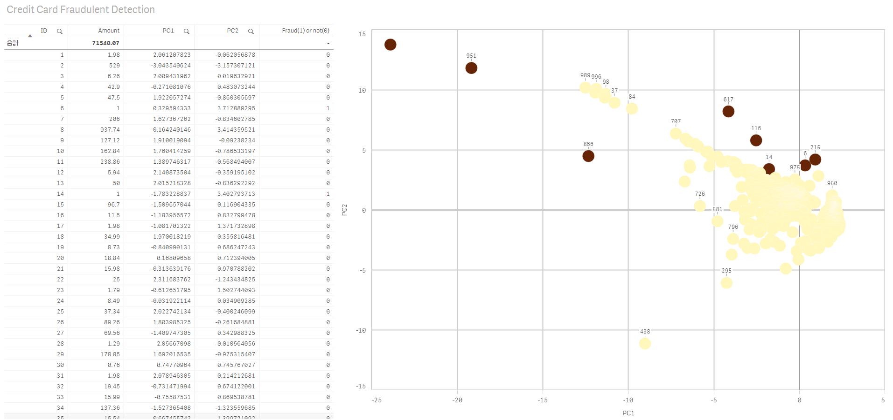

# Qlik Sense AAI example using SSE and Deep Neural Network written in  Python/TensorFlow/Keras - Credit Card Fraudulent Detection
In this example, a predictive model is created with deep neural network written in Python/TensorFlow/Keras using [Detect credit card fraudulent](https://www.kaggle.com/dalpozz/creditcardfraud) datasets. Qlik Sense integrates with the python code through AAI/SSE, and it displays the prediction results using the prebuilt model to show if the incoming credit card transactions are fraudulent or not.

## Prerequisites
* Install Qlik Sense. (Qlik Sense June 2017 release or later)
* Install [server-side-extension](https://github.com/qlik-oss/server-side-extension). Follow the instructions on the [Getting started with the Python examples](https://github.com/qlik-oss/server-side-extension/blob/master/examples/python/GetStarted.md) and [Prerequisites for running the Python examples](https://github.com/qlik-oss/server-side-extension/blob/master/examples/python/prerequisites.md) to install it. Assure if it is installed and configured correctly by testing with the sample apps included in the SSE R-plugin.
* Install TensorFlow by following [Install TensorFlow on Windows](https://www.tensorflow.org/install/install_windows).
* Install Keras by following the [instruction](https://keras.io/#installation).

## Installation
1. Download the latest codes from this repository.
2. Place the unzipped codes under %DIR_YOU_INSTALLED_SSE%\examples\python directory.
3. Add SSE Plugin settings:
  * Qlik Sense Desktop
	 * Add SSEPlugin=CreditCard,localhost:50050 on a new line in your Settings.ini file located at C:\Users\%username%\Qlik\Sense.
  * Qlik Sense Enterprise
	 * Add the SSE plugin settings in QMC under Analytic connections by inserting the following values: name: CreditCard, host: localhost, port: 50050
4. Copy the sample app 'Credit Card Fraudulent Detection.qvf' contained in the downloaded code to C:\Users\%username%\Qlik\Sense\Apps directory. (Import the app on QMC for Qlik Sense Enterprise.)

## How to use
1. Build a predictive model
 * Open modelling.ipynb with Jupyter notebook and select [Kernel] > [Restart & Run All] to execute the script. After the compilation and fitting of the model is finished, the predictive model is written to the file named 'model.hdf5'.

2. Execute python script
 * Open [Anaconda Prompt], move to the directory where the downloaded codes are stored and execute the following command:

    `python ExtensionService_CreditCardFraud.py`

    Wait until the following message appears on the console:

    ` - INFO - *** Running server in insecure mode on port: 50055 ***`

  * Restart Qlik Sense Engine Service. Make sure that the following message has appeared on the console.

    ` INFO - Adding to capabilities: PredictFraud(['str01', 'str02' ...`
3. Open Qlik Sense app
  * Open 'Credit Card Fraudulent Detection' app on Qlik Sense. You can find the prediction result in the 'fraud(1) or not(0)' column on the table. The data points of fraudulent transactions are also colored with dark red on the scatter chart.
  

## Author

**Masaki Hamano**
* https://github.com/mhamano/

## License & Copyright
The software is made available "AS IS" without any warranty of any kind under the MIT License (MIT).

See [Additional license information for this solution.](LICENSE.md)
